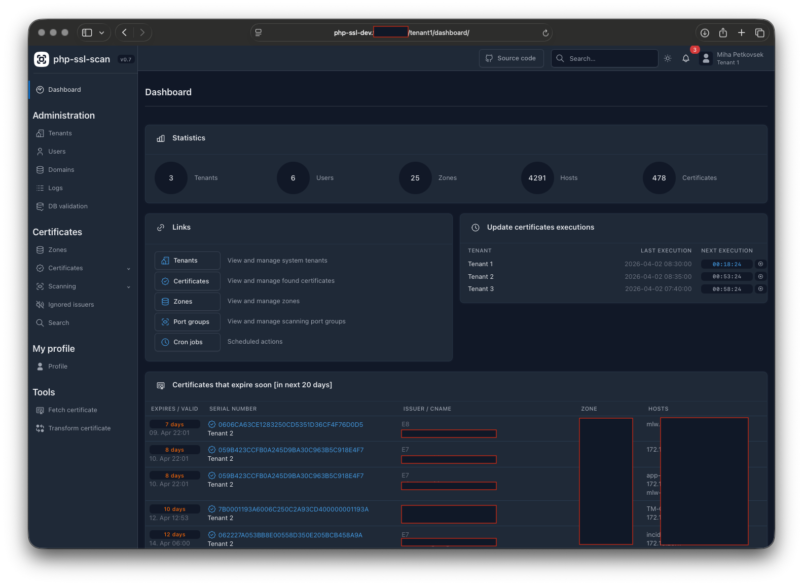

## php-ssl :: php certificate scanner

php-ssl is a php certificate scanner webapp, that checks predefined hostnames for any certificate changes. Its main goal is to provide visibility into certificates used for specific domains or hostnames. It supports zone-transfers from DNS servers to make sure all hosts are automaticcaly added to host list and regularly checked for SSL changes. It also has support for remote scanning agents because of limitations with DNS name resolution for SSL scans.

## Main features
- Tenant support
- API scanning clients
- Automatically imports hostname entries from DNS database (AXFR)
- Automatic hosts scanning for new certificates (cron script)
- Certificate change email notifications (cron script)
- Daily certificate expiry notifications (cron script)
- On-demand certificate fetch from website
- Certificate details page
- Certificate chain validation
- per-host notifications and ownership settings


## Screenshots



***

## Requirements:
php-ssl has following requirements:
- any linux/unix distribution
- apache/nginx webserver
- php8+ (untested on php7 but should work)
- MySQL database server
- php modules:
  - curl
  - gettext
  - openssl
  - pcntl
  - PDO
  - pdo_mysql
  - session

## Installation

Clone code via git:phpssladmin
```
cd /var/www/html/
GIT clone --recursive https://github.com/phpipam/php-ssl.git php-ssl
```
Copy config file and edit accordingly:
```
cp config.dist.php config.php
```

Create database and import default content:
```
mysql -u root -p
mysql# create database `php-ssl`;
mysql# create user 'phpssladmin'@'localhost' identified by 'phpssladmin';
mysql# grant all on `php-ssl`.* to 'phpssladmin'@'localhost';
mysql# flush privileges;
mysql# exit

mysql -u root -p php-ssl < db/SCHEMA.sql
````

## Cronjob

For automated cronjob tasks add following to you cron file:
```cron
# php-ssl cronjobs
*/5 * * * * /usr/bin/php /var/www/html/php-ssl/cron.php
```
