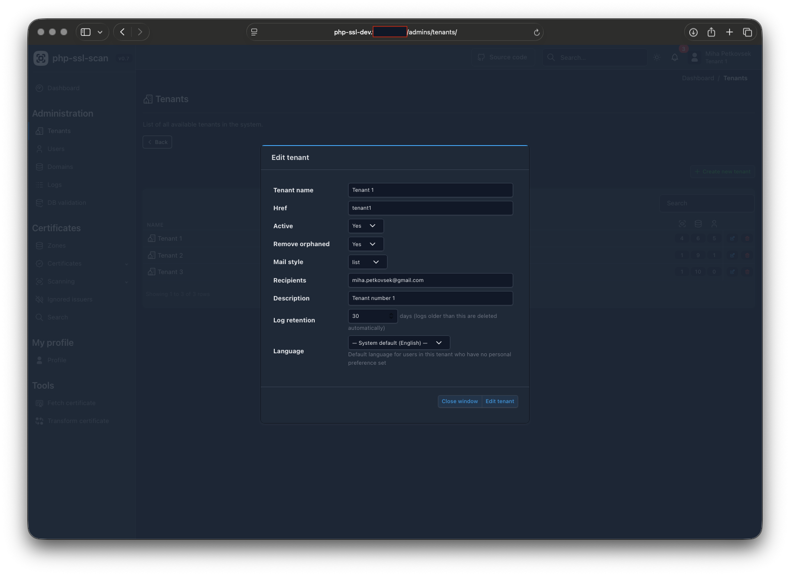
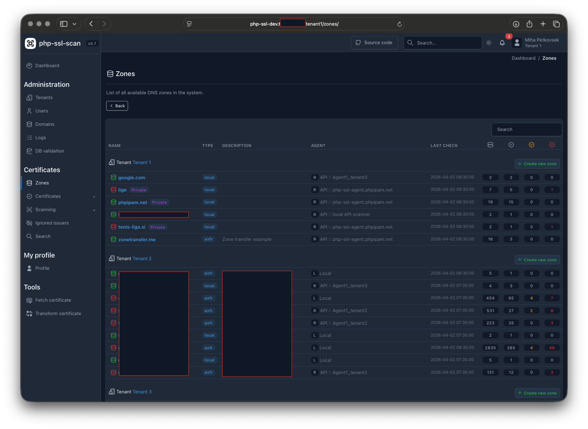
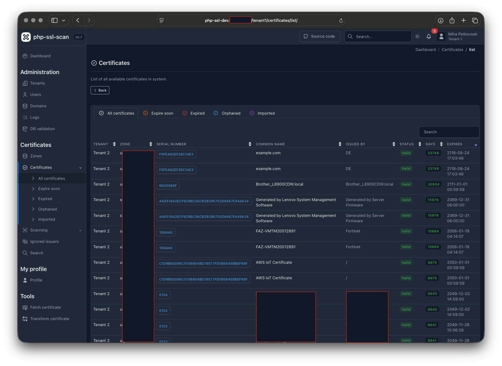
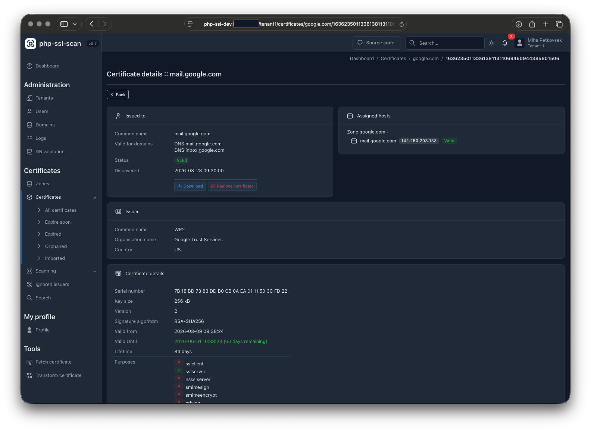
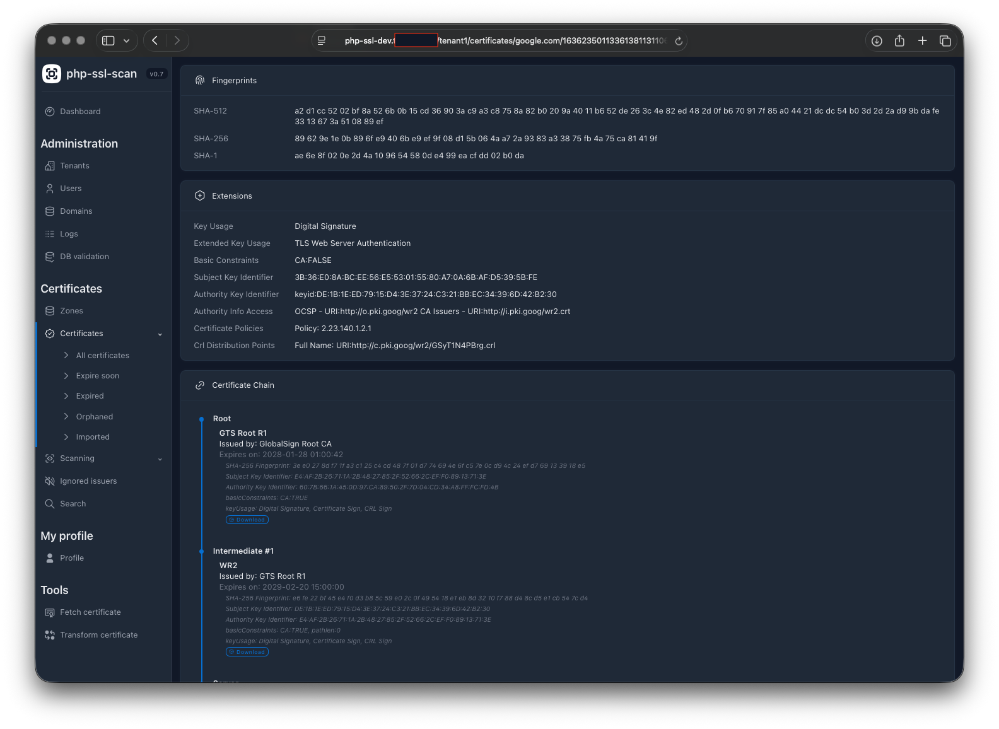
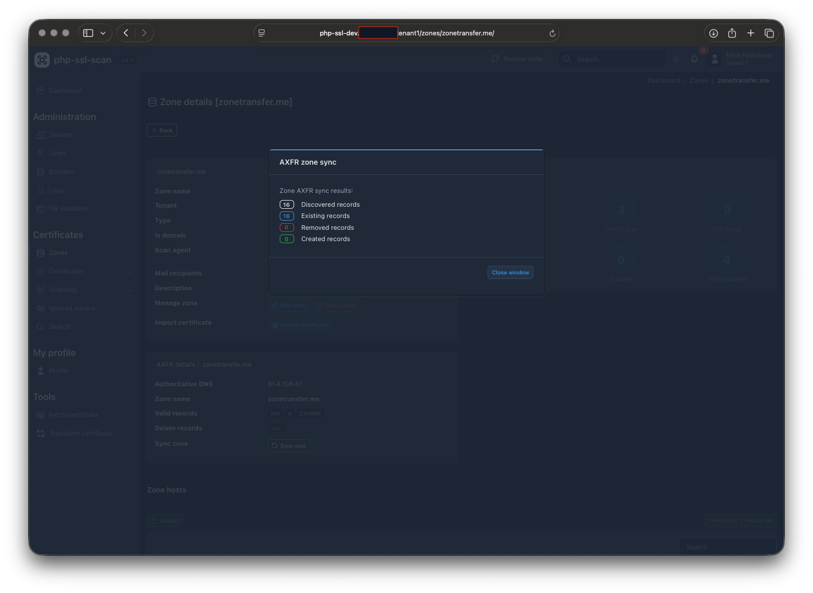
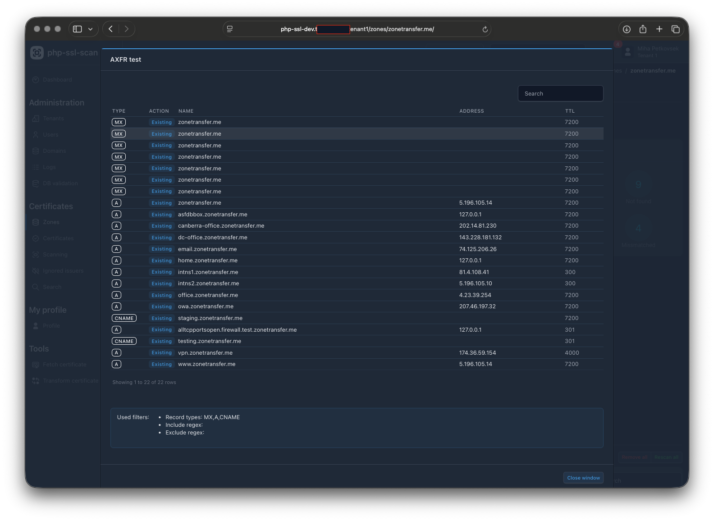
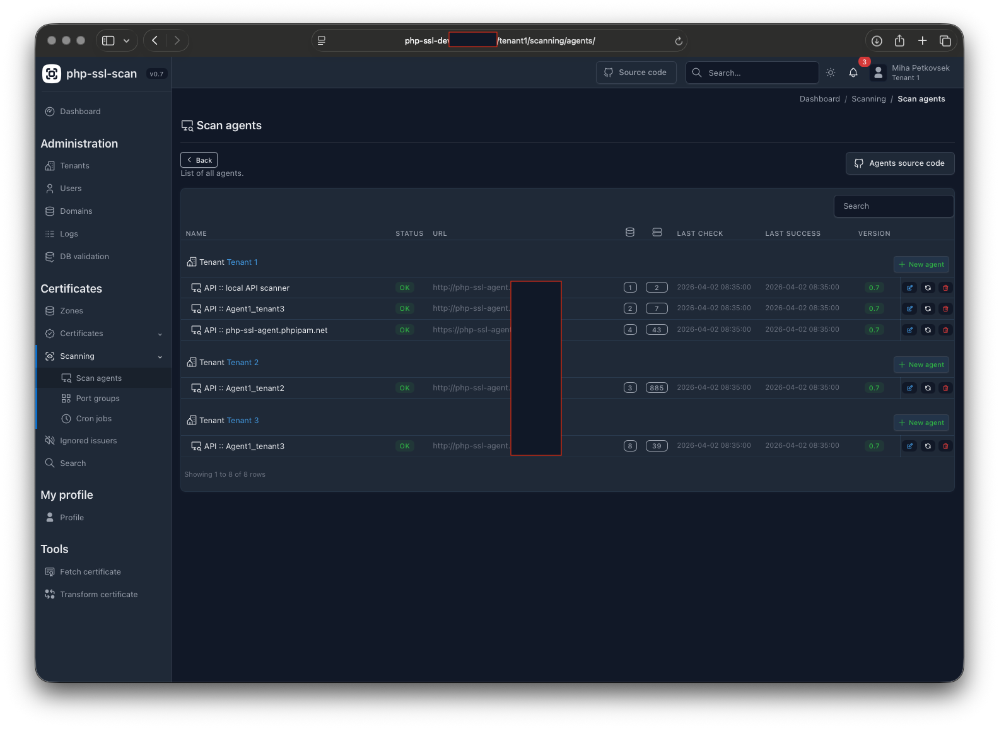

## php-ssl :: php certificate scanner

php-ssl is a PHP 8+ SSL/TLS certificate monitoring web application. It scans predefined hostnames
for certificate changes and provides visibility into certificates used for specific domains or
hostnames. It supports DNS zone transfers (AXFR) to automatically discover and track hosts,
remote scanning agents for environments with restricted DNS resolution, and email notifications
for certificate changes and upcoming expirations.

## Main features

- **Multi-tenant** support with full tenant isolation
- **Remote scanning agents** for environments with limited DNS resolution
- **DNS zone transfer (AXFR)** — automatically imports hostnames from DNS servers
- **Parallel scanning** — multi-process certificate scanning via `pcntl_fork`
- **Certificate change notifications** — email alerts when a certificate changes (cron)
- **Certificate expiry notifications** — daily alerts for certificates nearing expiration (cron)
- **On-demand certificate fetch** from any hostname
- **Certificate details** page with chain validation
- **Per-host notification and ownership** settings
- **Ignored issuers** — suppress notifications for specific certificate issuers per tenant
- **Active Directory / LDAP** user synchronization
- **Per-tenant configuration** overrides (expiry thresholds, mail settings, etc.)
- **Audit logging** — full change history for all managed objects
- **Search** across certificates, zones, and hosts
- **Dark / light theme** toggle
- **Database backup** with configurable retention


## Screenshots

<table>
  <tr>
    <td></td>
    <td></td>
    <td></td>
  </tr>
  <tr>
    <td></td>
    <td></td>
    <td></td>
  </tr>
  <tr>
    <td></td>
    <td></td>
    <td></td>
  </tr>
</table>


## Requirements

- Linux/Unix distribution
- Apache or nginx web server
- PHP 8.0+
- MySQL database server
- PHP extensions: `curl`, `gettext`, `openssl`, `pcntl`, `PDO`, `pdo_mysql`, `session`

## Installation

Clone the repository (including submodules for Net_DNS2 and PHPMailer):
```
cd /var/www/html/
git clone --recursive https://github.com/phpipam/php-ssl.git php-ssl
```

Copy and edit the config file:
```
cp config.dist.php config.php
# Edit config.php: set DB credentials, mail settings, and BASE path
```

Open the web installer in your browser and follow the steps:
```
http://<your-server>/php-ssl/install/
```

The installer will create the database, application user, and import the schema automatically.
Once installation is complete, set `$installed = true` in `config.php` to disable the installer.

## Cronjob

Add the following to your crontab for automated certificate scanning and notifications:
```cron
# php-ssl cronjobs
*/5 * * * * /usr/bin/php /var/www/html/php-ssl/cron.php
```

Cron job schedules are managed per-tenant in the application UI (Scanning → Cron). The system
crontab entry only triggers `cron.php` every 5 minutes; the application checks its internal
schedules to decide which scripts to run.

To run a cron script manually:
```
php cron.php <tenant_id> <script_name>
# e.g.: php cron.php 1 update_certificates
```

Available cron scripts: `update_certificates`, `axfr_transfer`, `expired_certificates`,
`remove_orphaned`, `backup`.
